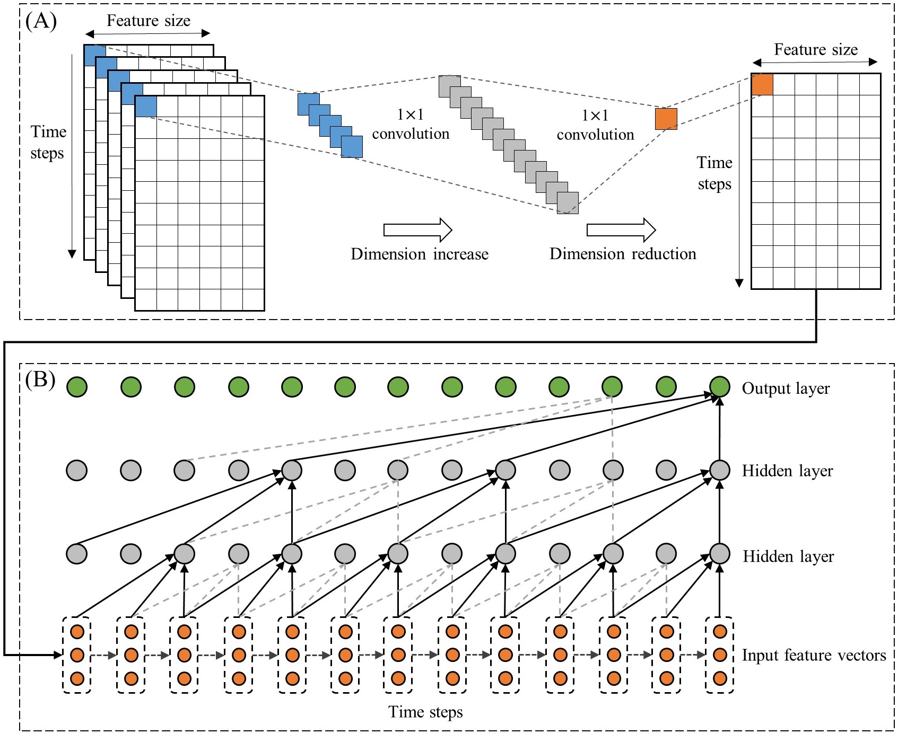

# ST-CausalConvNet
A Spatiotemporal causal convolutional network for predicting PM2.5 concentrations.

## Research paper

Experiments are done by using PyTorch. If you find this repository helpful, please cite our work:

> Zhang, L., Na, J., Zhu, J., Shi, Z., Zou, C., Yang, L., 2021. Spatiotemporal causal convolutional network for forecasting hourly PM2.5 concentrations in Beijing, China. ***Computers & Geosciences*** 104869. [https://doi.org/10.1016/j.cageo.2021.104869](https://doi.org/10.1016/j.cageo.2021.104869)

## Requirement

- Python3
- Numpy
- Pandas
- PyTorch (>= 1.6.0)

## Model architecture

The architecture of ST-CausalConvNet, which includes two parts: (A) integration of the spatiotemporal information of multiple monitoring stations; (B) causal convolutional network (for the following example of the model architecture, kernel size = 3 and dilations = 1, 2, and 4).



## Description of data and files

- **data (directory)**:
  - **microsoft_urban_air_data**: The air-quality dataset from the Urban Computing Team in Microsoft Research (see the [web page](http://research.microsoft.com/en-us/projects/urbanair) for getting more help of how to use this).
  - **stations_data**: The data for each station in Beijing are separately stored in this directory.
  - **xy**: X and y matrices (saved as the pickle file format) for the input of the deep learning model.
- **models (directory)**: The folder for storing the model.
- **config.py**: The configuration file for setting the input data location, model parameters and model storage path.
- **data_process**: For extracting the data of the selected center station and high correlated other stations, and transform the original data into the high dimensional matrix for matching the input structure of the model.
- **eval.py**: For evaluating the model performance on the test set.
- **models.py**: The core function for generating the ST-CausalConvNet for the prediction task. The model structure can be referred to the paper. It also contains the other models (SimpleRNN, GRU and LSTM) for comparison.
- **train.py**: It implements the reading parameters, data preparation and training procedure.
- **utils.py**: It contains functions for the data loading and generating batch data for training and validating.

## Usage instructions

#### Configuration

All model parameters can be set in `config.py`, such as the learning rate, batch size, number of layers, kernel size, etc.

#### Training the model

```python
python train.py
```

The program can automatically save the most accurate (with the lowest RMSE on validation set) model in the `models` directory.

#### Evaluation

```python
python eval.py
```

The saved model can be loaded and evaluating on the test set.

## License

[Apache License v2.0](./LICENSE)

## Thanks

We thanks the previous work [An Empirical Evaluation of Generic Convolutional and Recurrent Networks for Sequence Modeling](https://arxiv.org/abs/1803.01271) by Shaojie Bai, J. Zico Kolter and Vladlen Koltun, as the basic knowledge for TCN architecture in our research.

## Contact

For questions and supports please contact the author: Lei Zhang 张磊 (zhanglei@smail.nju.edu.cn)

